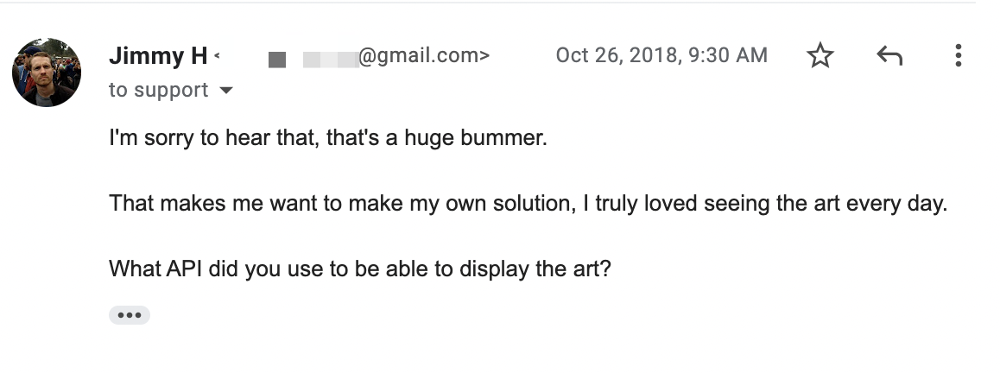
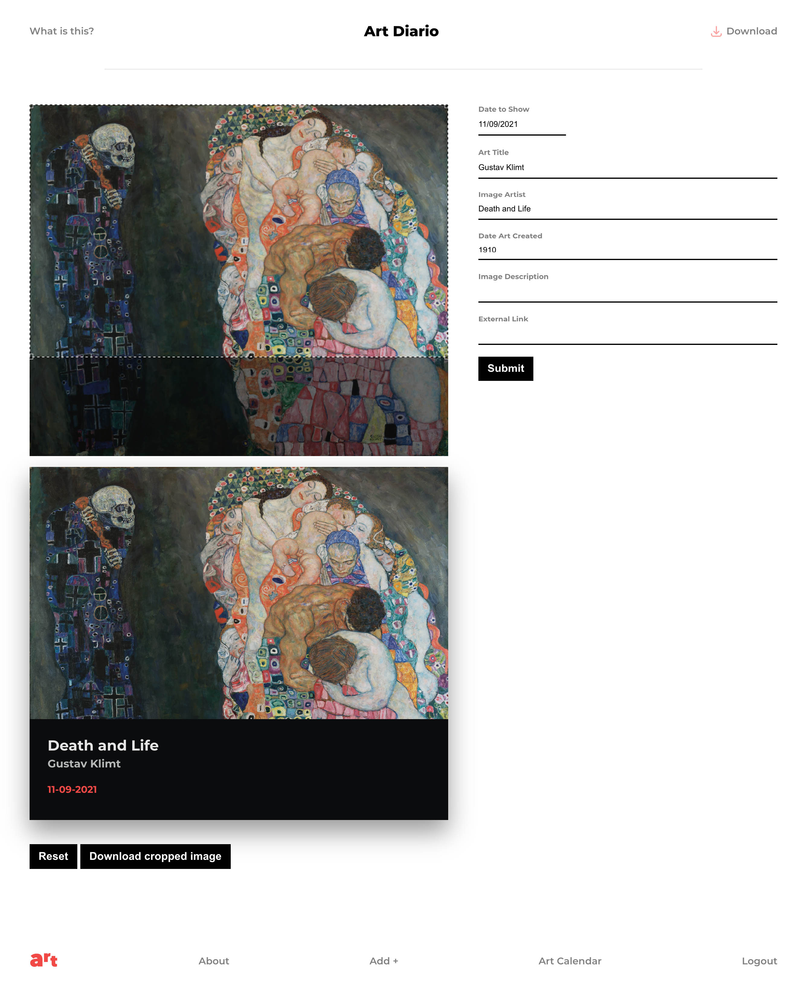
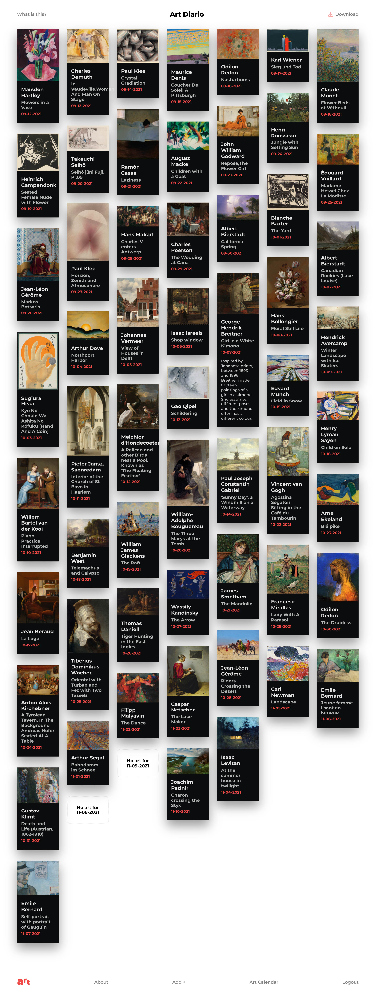

TL;DR - You should [download my simple little app](https://www.artdiario.com/download) that I have poured an insane amount of effort into making. Please only tell me that you love it, but also report bugs!

About two years ago I started [Lambda School](https://lambdaschool.com) part time. While I'd always been a technical kid, I never was able to dedicate the time to fill in the gaps of my programming knowledge. I could hack things together, but I lacked the ability to create cohesive CRUD apps. Anything beyond simple functions was way too much for me. I barely understood what an array was. Lambda School was the first time I could commit to learning programming without quitting my day job, and I jumped at the opportunity. 

There's a lot more to this story, and I want to write about it in more depth, but the long and short is that, while brutal, it worked, and I now know how to program in a lot more depth. 

A while back I stumbled on an app called [ArtPip](https://artpip.com/). It had this core idea of showing everyone who had the app the same piece of art per day. I loved it. I loved being exposed to art that I would have never otherwise seen, I loved how it lasted for 24 hours, and I loved that it was a shared experience with everyone who had the app. Unfortunately, the engineer building it wasn't able to continue, and eventually the app itself switched over to photographs instead of paintings. Photographs are great, but they're an entirely different medium. It felt like the core reason that I wanted to have the app installed was gone. 

How much I loved this concept really stuck with me. When the app died originally I really wanted to recreate it right then, but it would be another year until I started Lambda School, a year from then when I would create my first version, and another year after that until I could really polish it into something that other people could use. 

This is a very simple app conceptually. One piece of art per day, everyone see's the same art. That's it. It is purely because I love that core experience that I built it. I want everyone to have this same experience.

But, holy crap, was it difficult. There's a huge gap between a proof of concept and something much more polished. 

I wanted a beautiful website and an extremely easy to use admin area to upload and manage the art itself. I wanted everything to be fast, I wanted it to be easy to deploy, and I wanted it to be cheap as hell to host. I think, somehow, I've been able to finally manage all of this. 

A beautiful react single-page-app for the website/front-end admin, an express server/api for the backend, and an electron app for the desktop client. Mix in Netlify, AWS S3/Cloudfront, Heroku, Github actions, and Cloudflare caching on images and api calls. I'll have to do a technical deep dive in a future post, but the coordination between all these things was by far the most complex thing I've ever had the opportunity to build. 

I think I can honestly say this is the culmination of a life long dream to be able to design, build, and deploy apps. 

And, for a first app, I really am glad this is it. It is a pure app: No scheme to get you to buy anything. No agenda. It's purely about the experience of art. 

It's hard to convey how much you'll love it too. [Download it](https://www.artdiario.com/download), and don't do anything. Just let your desktop change each day. Have some friends download it. Suddenly you're talking about art. It's a subtle thing, and it makes me unreasonably happy.