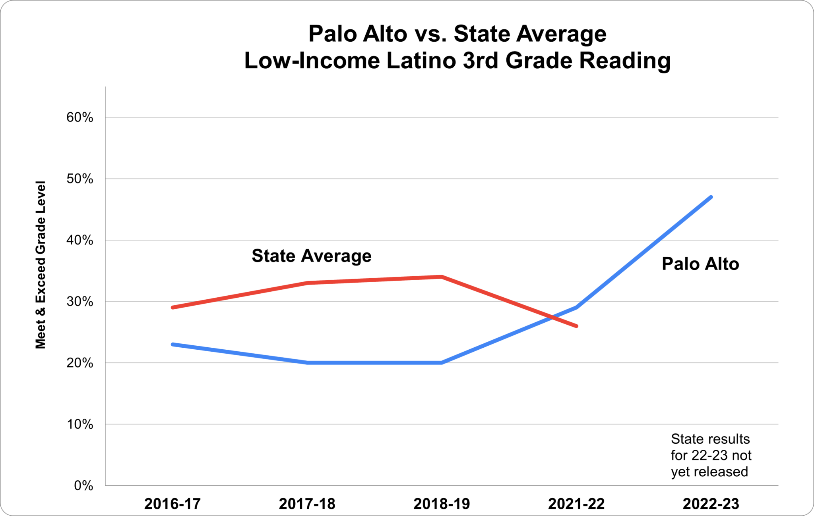
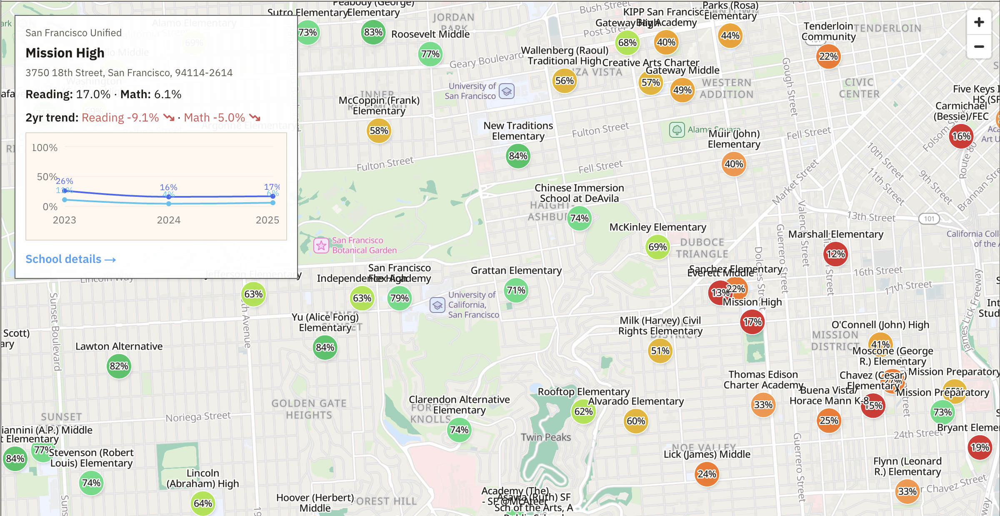
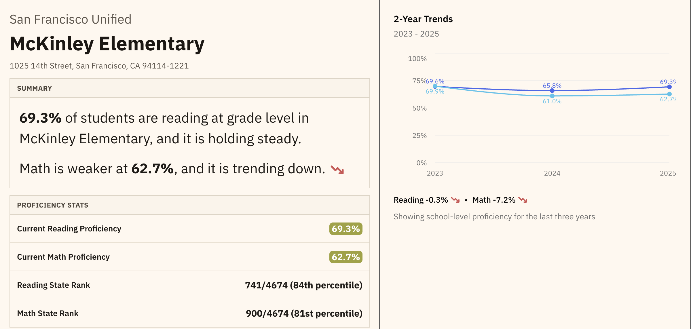
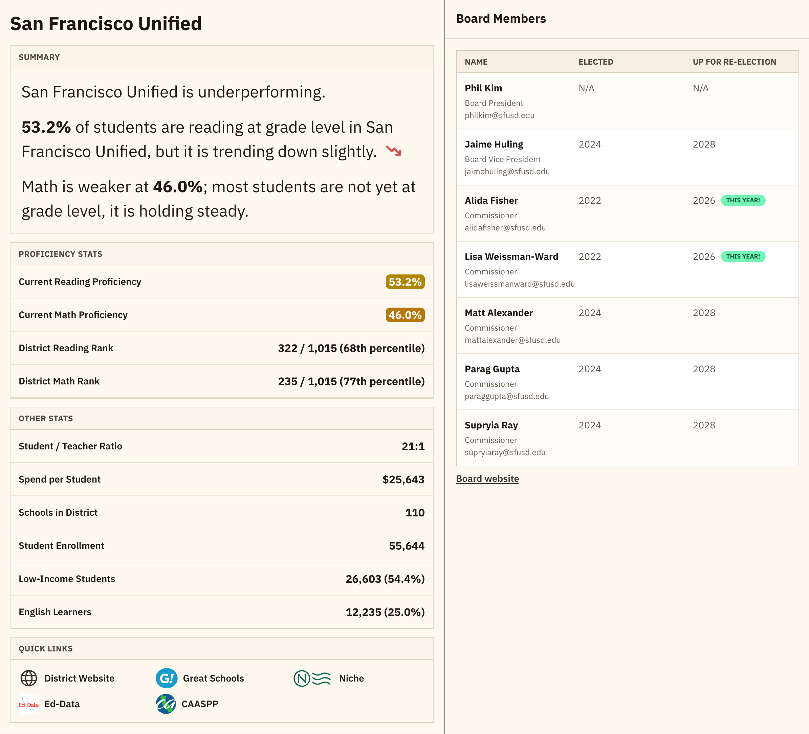
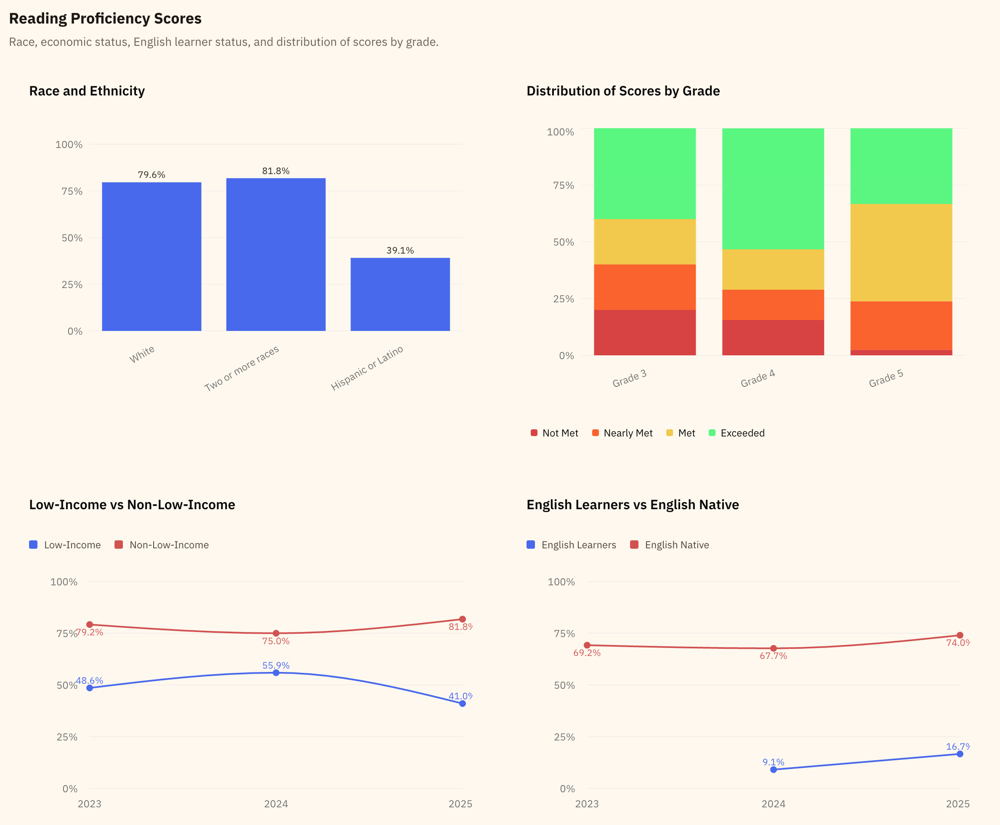

We're trying to buy a house in one of the highest cost of living areas of the United States, and the schools aren't even good. 

One thing we'd hear was "wealthier people are moving in who care about education, so this lower-performing school will improve". But was that true? How could we figure that out?

Certain websites like Great Schools or Niche will show you their custom score, but it usually obfuscates the underlying fundamentals. Certain schools end up with a 6/10 that have top-decile test scores. Other schools with pretty mediocre test scores had a 9/10. Why? It was hard to tell. Were they trending up? Down? It was difficult to find out. 

I ended up finding Page Turner, a non-profit that focuses on k-2nd grade reading proficiency. They had some pretty [great stats](https://app.beapageturner.com/school-reading-score-test-results-ranking/California/), but only for reading proficiency, and it was a bit challenging to navigate their website. 

Pre-AI I would maybe build some spreadsheets and manually put together some comparison. But since the updates in December 2025 with Claude and Codex, I felt like I had the opportunity to do something more interesting. 

California test scores are administered through CAASPP, and [all the data is public](https://caaspp-elpac.ets.org/caaspp/ResearchFileListSB?ps=true&lstTestYear=2025&lstTestType=B&lstCounty=00&lstDistrict=00000&lstFocus=a). I could build my own tool to make this easier to understand. 

Initially I had just two problems I wanted to solve for:
- I wanted to see if schools were improving or declining over the years
- I wanted to easily compare neighborhood-by-neighborhood

As I started to dig into this and produce the website, a few other things came up:
- I wanted it to be cheap and fast to host, everything heavily cached on Cloudflare
- I realized it really bothered me to see so many underperforming schools, and I wanted to understand why

I decided I wanted to:
- Use NextJS as the front-end framework
- Use MapLibre + ProtoMaps on R2 heavily cached on Cloudflare
- Normalize the CAASPP data into a SQLite database
- Produce json for each school and district at build time from the SQLite db, so it could be cached

Design is still unsolved by AI imo, so I designed everything in Figma, largely produced the front-end components via Pencil.dev, and built the thing out. Even though AI solved for an enormous amount of work on this project, it still took a ton of time to complete the site. I spent effectively all my free time for approximately 2 months to complete the site. 

While building it, I learned a bit about why schools underperform, especially for reading. And, surprisingly, some districts and states had solved for it. In Mississippi, they went from [49th in the nation for 4th grade reading](https://www.nytimes.com/2026/02/09/opinion/red-states-good-schools.html), to the top 10. For low-income students, they are now considered #1 in the country. Their surrounding states have noticed, and both [Alabama](https://www.economist.com/united-states/2026/02/12/alabama-offers-three-tricks-to-fix-poor-urban-schools) and Louisiana have reproduced their results. [Marietta, GA](https://www.marietta-city.org/news/news-details/~board/marietta-city-schools-district-news-marietta-city-schools-25755/post/marietta-city-schools-focus-on-literacy-creates-long-term-district-wide-success) has dramatically improved. Most people now call this phenomenon the "Mississippi Miracle".

So how do we do it? Well, [Palo Alto Unified](https://caschooltrends.com/districts/palo-alto-unified) has shown us the way for California. While it might seem that PAUSD is at the top of the game (and in many ways they are), they were not succeeding with low-income students. Todd Collins, the former President of the school board, decided to make this their core focus. They reproduced the key features of the Mississippi Miracle, and saw low-income students proficiency jump [almost 30 percentage points over the next 3 years](https://edsource.org/2023/how-any-district-can-could-move-the-needle-on-early-literacy/697137). 

So, now I'm motivated. This appears solvable, people have done this before. How do we get our school boards to do this? One thing I learned by working with the GrowSF team is that most people do not email their electeds. So, when most politicians get a bunch of emails, it is:
1. Very surprising
2. Very motivating

If it's so motivating and effective, why don't more people email? Well, there are a few problems you confront when you want to solve a problem in your local government. 
1. Who do I email?
2. What do I write?
3. What is my ask? What do I want them to do? By when?

Most people are:
- Bad writers
- Not going to search for politicians email addresses
- Pretty cynical about getting politicians to do things
- Not highly motivated

And people are busy! They elected these people so they didn't have to think about these problems. 

So, maybe I can utilize this site to make it easier for people to email their board and get them to focus on this problem with a template email. 

Now we've gotta solve two final problems:
1. We've gotta get accurate board data, like name, title, and email
2. We've gotta write a good email template and make it frictionless for people to send

The second seems pretty straight foward. The first means we've gotta scrape non-deterministic website data from the funkiest district websites you've ever seen. URL structures that make no sense, board member pages who's layout would make the most hardened developer wince, so much unnecessary javascript. Even just finding the district website is a challenge. 

I'm not quite finished with this, I've got the top 200 or so districts, but I'm pretty proud of the website. 

We have a map to navigate schools near you, where you can color by reading scores, math scores, or by the average of the two. We have detailed district details including board contact information. We have detailed sub-group performance over time. It makes it dramatically easier to understand your school, and if you feel so motivated, to email your board to promote reading proficiency as a goal. 

This was a ton of fun, both because it was a really big project that I feel is really important, and one that would have felt either impossible or would've taken way, way too much time pre-AI. 

Check it out for yourself! 

https://caschooltrends.com/