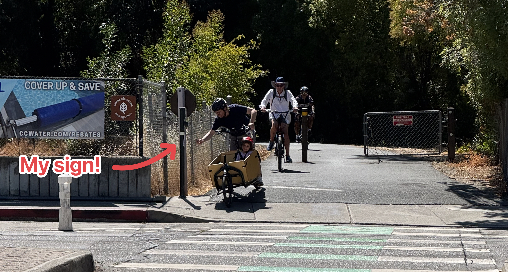

Many local politicians are elected by razor thin margins of hundreds of votes or less. This means you don't need a huge number of people to contact a politician to get their attention and influence their decision making.

One of my biggest realizations from working with [GrowSF](https://growsf.org) a few years ago was that creating a voting block that politicians _want_ to appeal to is the key way to create change. You as one person aren't super interesting, but if you can create a decent sized group that is focused on a particular issue, suddenly a politician might really want your group's endorsement for the next election. 

So, let's say you want something to change locally. Maybe an ordinance, or you want to improve the playground, or you want some flashing lights for your crosswalk to keep your kids safe. How do you get people to tell a politician that they want something and form your group?

Most people are:
- Bad writers
- Not going to search for politicians email addresses
- Pretty cynical about getting politicians to do things
- Not highly motivated

So how do you solve for these problems?

My tool of choice is QR Code signs. 

QR Code Signs have the following benefits:
- They are hyper-local, can be put right where the problem exists (motivation)
- Can load an email template right from a person's phone (no one has to write)
- Can load the email addresses that you want it sent to (no one has to look up their politicians email)
- Extremely low friction (just use your camera, overcomes cynicism)

If your issue is popular with the locals, I promise your issue will get attention.

So, how do we do this?

# Guide

1. Write your email in a Google Doc. Proofread it. Get a friend or loved one to look it over. Send it to yourself. Make sure there's no grammar issues, clearly lays out the problem you want solved, and your expectation that they solve it. 
2. Find your local politicians email addresses. If the police would be useful, find the police chief's email. Consider whether or not the county has jurisdiction. 
3. Create a custom email to track who sends them, like localhelper@gmail.com
4. Take the contents of the email, and the email addresses you collected, and paste it into the to:, subject, and message fields of this tool and generate a mailto: https://mailtolinkgenerator.com/ - make sure to include your helper email in the to: field so you can track who actually sends the email (this is important to know if what you're doing is working, if you need to adjust messaging, etc)
5. Generate a tinyurl and QRCode by pasting the contents of the mailto into the long url field: https://tinyurl.com/
6. Create a flyer, you can use [this Google Doc](https://docs.google.com/document/d/1WPaE5VnOFAi5K_PcxBEdQokpOVXawGHriMXYsAh-nIs/edit?tab=t.0) as a template
7. Print it out and test it. Hold your phone up, send an email. Make sure it looks good. 
8. Hang them up!

These genuinely work! 

I've gotten an ordinance passed and over 100 emails sent using this method. I also have an active group that I can appeal to for other future issues I might care about. 

The beauty of this method is that you are getting real people to reach out to politicians for something they care about, _in the moment they care about it_. Normal people usually can't be bothered, so you are getting normal people involved in the political process, a rare thing! And it will make you feel better that you are helping improve your community by making it easier for constituents to reach out with real concerns. 

Be judicious about using this method, if there are QR Codes everywhere people will just start to ignore them. But it's a very useful method for accomplishing specific goals!